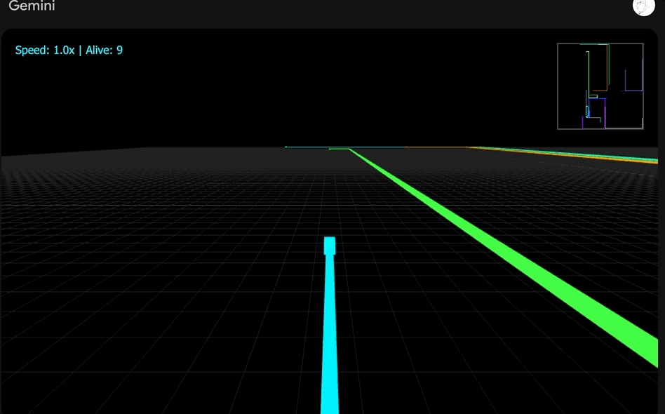
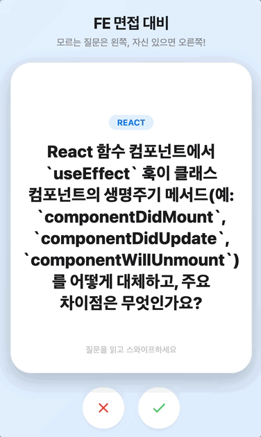
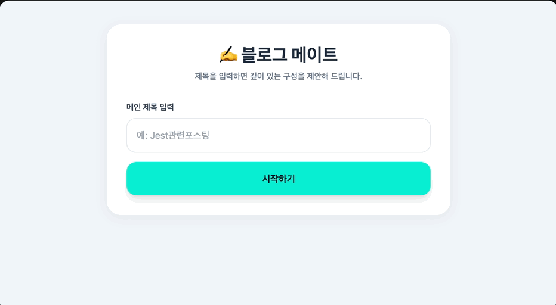

## ✅ 제출 체크리스트

- [x] 4개 웹앱 제출 (유틸리티 앱 1개 + 게임 1개 + 학습 앱 1개 + 페어 프롬프트 릴레이 1개)
- [x] 최소 1개 앱에 Gemini AI 기능 포함
- [x] 모든 앱이 배포 링크로 정상 동작함
- [x] AI 사용 일지 작성 완료

## 💻 1. 유틸리티 앱
[](https://gemini.google.com/share/9a3c194e17b1
)

### 앱 이름
마구마구읽기

### 배포 링크
https://gemini.google.com/share/9a3c194e17b1

### 이 앱을 만든 이유

- 가끔 긴 글이 읽히지 않을 때, 숏 폼 컨첸츠를 보듯 편하게 내용을 습득 할 수 있도록 함 
- 한번 읽었던 글을 빠르게 보고 싶을 때나 대중교통 이용 시 사용 

### 주요 기능

- 긴 글을 복사해서 붙여 넣으면 프로필 등의 메타데이터들은 최대한 제거하고, 본문만 읽기 편하게 가공한 뒤 짧게 분해해서 읽을 수 있도록 함
- 영단어의 경우 해석을 제공하여 편의성 증대함
- 10ms ~ 300ms 까지의 속도 조절이 가능하며, 재생바를 사용하여 돌아갈 수 있음

### AI 기능 (해당되는 경우)

- 입력된 글의 파싱 기준을 AI가 정합니다
- 입력된 글의 프로필이나 코드블럭 등의 필요 없는 텍스트들을 지워줍니다  
또한 영단어의 해석을 글자 아래에 작게 만들어 보여주도록 했습니다

## 🎮 2. 게임
[](https://gemini.google.com/share/4a022ec222fc)

### 앱 이름
트론 아레나(TRON ARENA)

### 배포 링크
https://gemini.google.com/share/4a022ec222fc

### 이 앱을 만든 이유

- 어릴 적 해본 플래시 게임 Tron LightCycle이란 게임이 어도비 플래시와 함께 사라진 후 내 기억속에만 존재하였는데 이를 다시 해보기 위함
- 간단한 플래시 게임을 하고싶을 때 사용

### 주요 기능

- 방향키 왼쪽, 오른쪽(←,→)과 스페이스바를 사용하여 진행
- 플레이어와 13인의 플레이어는 모두가 못 지나가는 벽을 만들며 최후의 1인이 되기 위해 싸움
- 7초마다 벽을 지우는 메테오가 등장
- 스페이스바를 누르면 모두 3턴 뒤의 행동을 하기 때문에 게임 템포를 높일 수 있음

## 📚 3. 학습 앱
[](https://gemini.google.com/share/4c841ed82bba)

### 앱 이름
스와이피(swapy)

### 배포 링크
https://gemini.google.com/share/4c841ed82bba

### 이 앱을 만든 이유

- 프론트 면접 준비를 돕기 위해 사용
- 한 손으로 면접 질문을 보고 싶을 때, 내가 뭘 모르는지 모르겠을 때 사용

### 주요 기능

- 5개의 FE면접 질문을 받을 수 있고 안다면 오른쪽, 모르면 왼쪽으로 스와이프
- 복습 단계에서도 읽고 아는 내용이면 오른쪽, 전혀 모르겠다면 왼쪽으로 스와이프


### AI 기능 (해당되는 경우)

- 프론트엔드가 알아야할 면접 질문들을 추천해주고, 그 질문의 정답을 가져옴

## 🤝 4. 페어 프롬프트 릴레이 앱
[](https://gemini.google.com/share/a315f554aad6)

### 앱 이름
블로그 메이트 (blog-mate)

### 페어
@jebiyeon02

### 배포 링크
https://gemini.google.com/share/a315f554aad6

### 이 앱을 만든 이유

- 매번 글을 작성하려고 했다가 어떤 내용을 써야될지 몰라서 결국 글쓰기를 포기하는 문제를 해결하기 위함

- 내가 블로그 글쓰기를 시작할 때 글의 소제목을 빠르게 정리할 때 사용

### 주요 기능

- 어떤 주제에 대해 글을 쓰려고 할 때, 그 주제에 연관되는 키워드들을 추천해줌
- 해당 키워드를 선택 시, 그 키워드에 대한 다른 주제들을 알려줘서 글쓰기 쉽게함
- 선택 종료 시, 선택한 주제들에 대하여 태그를 추천해줌 


### AI 기능 (해당되는 경우)

- 키워드와 선택당한 키워드의 관련되는 주제를 추천해주고 태그를 달아주는 AI를 사용

## 📝 AI 사용 일지 

### 대상 앱 이름
마구마구읽기  

### 1. 초기 프롬프트

#### 1단계 
```
"HTML, CSS, JavaScript만 사용해서 만들어줘.
React나 다른 프레임워크는 사용하지 마."

- 대상자는 긴 글이 안읽히는 사람을 위해서임

- 기능
텍스트를 마구잡이로 받아오면 거기서 내용을 AI로 정리한 뒤 
그 내용을 음절 단위로 나누어 화면에 출력하게 해주면됨(Spreeder처럼)
속도는 10부터 300까지 10단위로 조절 가능하고 
재생바가 있어서 되돌아볼수있음
마크다운도 가능 (마크다운 특수 문자 다 빼기)

-제한되는점
프로필이나, 제목 등은 없어도 돼
```

#### 2단계

```
1. 문장들을 좀더 쪼개줬으면 좋겠음 
2. 프로필이나 이름, 코드블럭 등은 안나왔으면 좋겠음
3. 번역 된 한국어는 글자밑에 작게 나와야돼
```
#### 3단계

```
타이틀에 마구마구읽기 추가해주고
전체적인 디자인 애플의 리퀴드 글래스 스타일로 해줘
```
### 2. 프롬프트 개선 과정

#### 처음 결과물의 문제점은 무엇이었나요?  
1. 속도의 기준이 없어 ai의 단위(speed)로 기준이 맞춰졌습니다.
2. AI본문 요약기능이 전체 문단을 30%정도로 줄여버렸습니다.

#### 어떤 식으로 프롬프트를 수정했나요?
1. 속도의 기준을 ms로 정하여 다시 수정했습니다.
```
속도는 10ms부터 300ms까지 10ms단위로 조절 가능하며, 기본 속도는 250ms로 설정
```

2. AI본문 요약 기능을 조정해달라고 부탁하였습니다. 
```
문장들을 좀더 쪼개줬으면 좋겠음
```

#### 몇 번의 반복을 거쳤나요?

- AI가 해주는 번역과 문장 요약의 기준을 명확히 제시하지 못하여 6번 반복하였습니다.


### 3. 효과적이었던 프롬프팅 전략

#### 어떤 방식으로 요청했을 때 원하는 결과가 나왔나요?
- 정확한 방향을 제시하거나, 하지 말아야할 것을 명확히 제시했을 때 제 마음에 들었습니다.

#### 반대로 효과가 없었던 방식은 어떤게 있었나요?
- 다른 웹사이트의 정보를 가져오거나, AI에게 구둑로 `너가 알아서 해봐` 등의 대충 던저진 명령어는 제 의도와 전혀 다른 결과를 내곤 했습니다.


> 링크를 받아서 브랜치나, velog의 글 들을 편하게 보려고 하였습니다. 하지만 링크를 가져오는 중 많은 에러(fetch실패, 엉뚱한 문장 가져오는 버그)가 생겨 스크래핑을 포기하게 되었습니다.

### 4. 배운 점

#### Gemini Canvas를 효과적으로 사용하기 위한 나만의 팁이 있다면?

- 실제 존재하는 앱이나 기능을 레퍼런스 삼으면 말을 잘 알아듣는 것 같았습니다.  


### 5. 리뷰어에게 피드백 받고 싶은 포인트
해당 미션에서 1, 2, 3단계로 나누어 프롬프트를 작성하라고 되어 있었는데, 제가 짧은 시간 동안 미션을 진행해 본 결과 수정 횟수를 줄이고 초기 프롬프트에 많은 내용을 작성하는 것이 더 효율적이라고 느꼈습니다. 그래서 초기 프롬프트에서 문제가 생기면 새로운 세션으로 갈아탔습니다.

하지만 이는 잘 만들어지고 있음에도 마음에 들지 않으면 내려버리는 작업 방식을 택하고 있는 것 같아, **수정을 잘하는 방법** 을 알고 싶습니다.